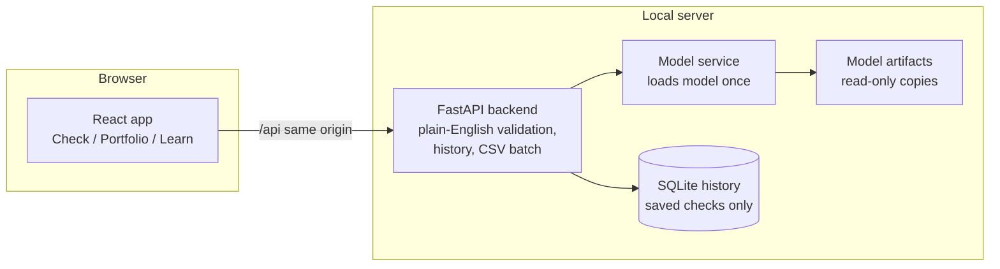

# Client Leaving Risk Checker

A simple tool for account managers and client success teams.

**What it does:** you enter a few details about a client, and the tool tells you
how likely the client is to leave, why, and what to do next. It has three pages:
**Check** (one client or a CSV upload), **Portfolio** (who to contact first) and
**Learn** (plain-word glossary, FAQ, and how the model works).

> **Practice data.** The tool is built and tested on made-up data, not real
> Highspring clients. Numbers show the tool works, not real results.

## How it fits together



- The trained model (`churn_model.joblib`), its metadata and the report files
  are **never modified**. A script copies them into `backend/artifacts/`.
- `predict_utils.py` from the original project is reused as-is for scoring; the
  backend only loads it once and adds plain-English outputs around it.
- The database stores only saved checks (save=true) and batch runs: timestamp,
  inputs, outputs, model version, mode, Client_ID. Nothing else personal.

## Run it locally (no Docker)

Prereqs: Python 3.12+ and Node 20+.

```bash
# 1. Copy the read-only model artifacts into the backend
python churn_system/scripts/copy_artifacts.py

# 2. Backend (fresh virtualenv recommended - versions are pinned to the
#    exact environment the model was trained in)
cd churn_system/backend
python -m venv .venv && source .venv/bin/activate
pip install -r requirements.txt
uvicorn app.main:app --port 8000

# 3. Frontend (new terminal)
cd churn_system/frontend
npm install
npm run dev            # http://localhost:5173
```

## Run it with Docker

```bash
cd churn_system
cp .env.example .env      # optional: set an API key
docker compose up --build
# open http://localhost:4173
```

## API

| Method | Path | What it does |
|---|---|---|
| GET | `/api/health` | Is the service up and the model loaded. |
| GET | `/api/model-info` | Features (ranges, typical values), thresholds, test metrics, quick-check fields, practice-data disclaimer. |
| GET | `/api/glossary` | Every label, definition, example, range and direction hint used in the UI. |
| POST | `/api/predict?save=false\|true` | Score one client. `save=false` (default) writes nothing; `save=true` stores the check. Body: client fields + `mode: balanced \| catch_more`. |
| POST | `/api/predict/batch` | CSV upload (max 5,000 rows). Returns results plus rejected rows with plain reasons. |
| GET | `/api/predict/batch/template` | Download the CSV template. |
| POST | `/api/what-if` | Score a client before and after changes (kept for API users). |
| GET | `/api/segments` | Segment tiles: client counts and money at risk. |
| GET | `/api/save-now?limit=50` | The call-first list, highest money at risk first. |
| GET | `/api/predictions` | History of saved checks and batch runs. |
| GET | `/api/figures/{name}` | Whitelisted report figures (PNG) only. |

Errors always come back as `{"error": "<plain English>", "detail": [...]}` -
never raw codes. An optional API key can be required via the `CHURN_API_KEY`
env var (header `X-API-Key`).

## Tests

```bash
# backend (14 tests: parity with predict_utils, validation, save semantics,
# batch, what-if, history, health, glossary coverage incl. data_origin)
cd churn_system/backend && python -m pytest tests/ -q

# frontend (13 Vitest tests) + build + type check
cd churn_system/frontend && npm test && npm run build

# end-to-end (Playwright: flows, minimalism budget, screenshots)
npx playwright test

# design + accessibility probes (needs servers running, see e2e config)
node probe_design_qa.mjs && node probe_axe.mjs

# readability (grade <= 8). If python-playwright is missing:
cd churn_system/frontend && node e2e/extract_readability_texts.mjs
python churn_system/scripts/check_readability.py --texts /tmp/readability_texts.json
```

## Screenshots

Shot by Playwright into `docs/screenshots/`:

| File | What it shows |
|---|---|
| `check-empty.png` | Check page, first visit (calm empty state). |
| `check-result.png` | A result: score, band, reasons, next step. |
| `check-tooltip.png` | A field tooltip open (desktop). |
| `check-mobile-tooltip.png` | Check page at 375 px with tooltip. |
| `check-demo-pills.png` | The small `demo` pill next to a tagged field. |
| `check-tooltip-demo-line.png` | A field tooltip ending with its demo line. |
| `many-clients.png` | CSV upload tab. |
| `portfolio.png` | Segment tiles, call-first list, capacity chart. |
| `learn.png` | Learn > About this project (default tab). |
| `learn-about-desktop.png` | About tab at 1280 px, full page. |
| `learn-about-mobile.png` | About tab at 375 px, full page. |

## Moving to real Highspring data

The running app works on demo values so the tool can be exercised end to end
without touching client records: six fields come from a telecom practice set
and the other 16 are simulated. Every glossary field carries a `data_origin`
(`telecom_base` or `simulated`), which is what each field tooltip's demo line
and the small **demo** pill on Contract length, Plan, Monthly payment and
Total paid so far read from. `Learn > About this project` shows the same
breakdown in the UI.

| What | Status | Note |
|---|---|---|
| The problem and the users | Built for Highspring | Taken from Highspring's own client work. |
| The details we ask about (content quality, guidelines, activity, help requests, Search visibility) | Built for Highspring | Chosen because they matter in this work. |
| The four groups and next actions (Save now, Automated nudge, Nurture, Monitor) | Built for Highspring | Made for the Highspring team. |
| The scoring method and the checks | Reusable | Works the same way with real data. |
| Client rows and their values | Demo | Practice data. Not real Highspring clients. |
| Contract, service package, monthly payment | Demo | Borrowed from a telecom dataset. Real data will replace them. |
| Accuracy numbers | Demo | They show the tool works. They are not real Highspring results. |

What changes when real data arrives:

- Service package becomes the client's real service line.
- Contract length becomes the real type of engagement.
- A client type (advertiser, publisher or website owner) can be added.
- The practice details are replaced with real data from client records,
  content ratings and support systems.
- The model is trained again and checked on real history.
- A small pilot with a control group tests whether the suggested actions
  really help.

Method checked on practice data. Ready to plug in real Highspring data.

## Known limitations / next steps

- **Practice data only.** Built on made-up data; needs real client data before
  any business use.
- **One region, one industry.** Patterns will differ elsewhere.
- **Drift.** Scores go stale as behaviour changes; add monitoring and a
  retraining schedule (the model itself was left untouched here).
- **Risk is not response.** A high score does not mean the client will respond
  to our help. A small pilot with a control group is needed to measure real
  impact.
- **No login yet.** Anyone with the URL can use it; add auth before sharing.
- The single-client API uses the training-set median of monthly value x 24 as
  its value reference (same rule as the original project's batch scoring).
